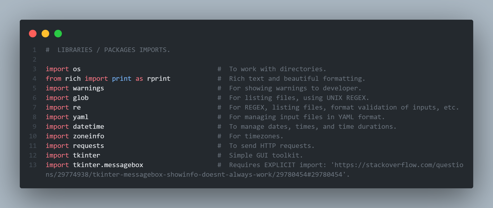
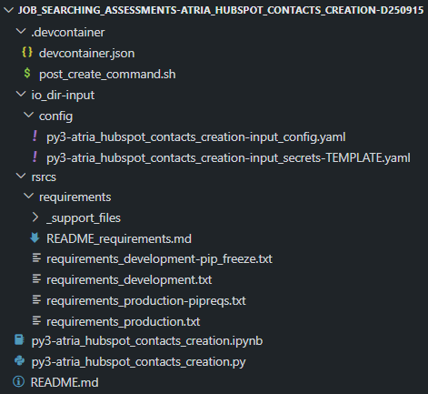
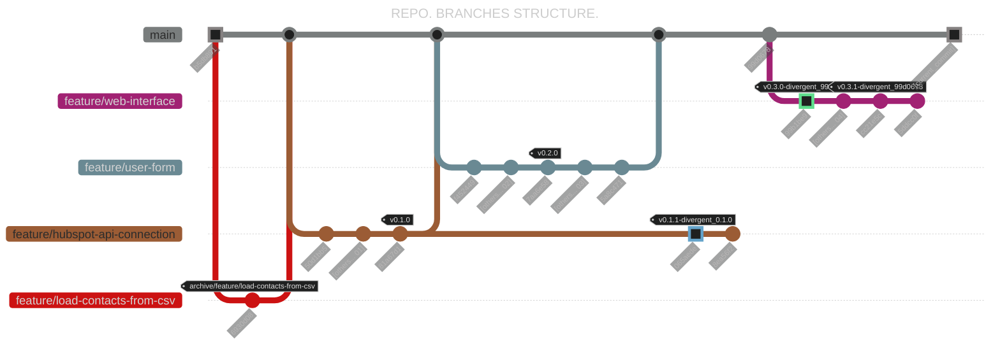
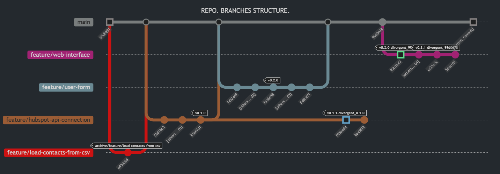

<!-- Badges:
- Source: 'https://shields.io/docs/static-badges', 'https://shields.io/badges/static-badge'.
- HTML structure followed: 'https://github.com/facebook/docusaurus/blob/main/README.md?plain=1'.
- Badges with logos: 'https://shields.io/docs/logos', 'https://simpleicons.org/', 'https://github.com/simple-icons/simple-icons/blob/master/slugs.md'.
- HTML <a> tag not redirecting: 'https://stackoverflow.com/questions/8260546/make-a-html-link-that-does-nothing-literally-nothing/8260561#8260561', 'https://www.geeksforgeeks.org/html/how-to-create-html-link-that-does-not-follow-the-link/'.
-->

<!-- Badge: WIP
<div align="left">
  <a href="#" onclick="return false;"></a>
</div> -->
<!--
🚧 WIP: section under construction. 🚧
-->

<!-- Badge: Done -->
<div align="left">
  <a href="#" onclick="return false;"></a>
</div>

<!-- README structure followed:
- 'https://www.aluracursos.com/blog/como-escribir-un-readme-increible-en-tu-github/'.
- 'https://github.com/camilafernanda/GlicoCare/'.
- 'https://github.com/nasa/openmct/'.
- 'https://github.com/facebook/docusaurus'.
-->

# [💼 Job Searching Assessment] atria: Create Contacts in a HubSpot Account using a Form.

<!--
<p align="center">
  🌐 '<a href="[URL for deployment]">[URL for deployment]</a>'
</p>
-->

> [!IMPORTANT]
> The website URL available in the 'About' section of this GitHub's project page is related to the branch '`feature/web-interface`', NOT this '`main`' branch. For details about the web app, such as it's development and why it hasn't been merged with '`main`', please refer to the corresponding branch.

<!--
Enable autoplay of animated images:
- 'https://stackoverflow.com/questions/72508378/enable-gif-autoplay-on-github-readme/72509078#72509078'.
- 'https://github.com/orgs/community/discussions/47709'.
- 'https://github.com/settings/accessibility'.
Image width for GitHub READMEs:
- 'https://github.com/orgs/community/discussions/42424'.
- 'https://gist.github.com/uupaa/f77d2bcf4dc7a294d109'.
-->
<!-- <div align="center">
    
</div> -->
<div align="center">
    
</div>

This repo. contains the code developed for a technical assessment for the position of 'Backend Developer', in the month of September, 2025.

# 📝 Instructions.

```

Test is about developing with a free* HubSpot account. You are required to create a project in NodeJS, Python, PHP, or your preferred programming language, in order to connect to the HubSpot account and allows the creation of contacts using a form asking for name, last name, and email. The project must be uploaded to a GitHub's repository.

Tip: to be able to connect to HubSpot, it's recommended to create a private app with permissions to read and write contacts.

You can use any AI tools, but it's important to understand what you will build. When presenting, there will be questions about it.

*https://www.hubspot.com/pricing/crm

```

# ℹ Notes on Project Structure and Code Execution.

## Code Execution.

You can run the code **straight out-of-the-box**\* (almost\*\*) by cloning this repo. and running the top-level python file [`py3-atria_hubspot_contacts_creation.py`](py3-atria_hubspot_contacts_creation.py).

> [!NOTE]
> \*Assuming you have experience using VS Code's devcontainers. Otherwise, you will require to do the additional step of installing the appropiate packages / libraries.

\*\*The **only pre-configuration required** is your input of your [HubSpot access token](https://developers.hubspot.com/docs/apps/legacy-apps/private-apps/overview#make-api-calls-with-your-app%E2%80%99s-access-token). In order to do so, please follow instructions in the file [`py3-atria_hubspot_contacts_creation-input_secrets-TEMPLATE.yaml`](./io_dir-input/config/py3-atria_hubspot_contacts_creation-input_secrets-TEMPLATE.yaml).

### Using devcontainers.

1. Execute the top-level python file; e.g. open [`py3-atria_hubspot_contacts_creation.py`](py3-atria_hubspot_contacts_creation.py) > Righ-click > 'Run Python' > 'Run Python File in Terminal'.

### Running Script on Standalone Environment.

1. Install python packages / libraries.

    - Within a console / terminal / CLI: e.g. `pip install PyYAML`.
    - Within a Jupyter Notebook: e.g. `%pip install PyYAML`.

    You can review the list of packages / libraries to install in the section `#  LIBRARIES / PACKAGES IMPORTS.` inside the python file [`py3-atria_hubspot_contacts_creation.py`](py3-atria_hubspot_contacts_creation.py).

    <div align="center">
        
    </div>

> [!NOTE]
> In the python file, the section **before** called '`#  LIBRARIES / PACKAGES MANUAL INSTALLATION, if not using devcontainers in VS Code, but single '.py' file stand-alone running.`', corresponds to a suggestion on commands to follow to properly install packages required. **You can use it as guide**.

2. Execute the top-level python file, [just like when using devcontainers](#using-devcontainers).

## Code Development.

**FILE STRUCTURE.**

If you want to dig into the code, you'll have to consider the **base** structure of the project, in order to make any adjustment:

<div align="center">
    
</div>

<table>
    <tr>
        <th>File or Folder</th>
        <th>Path and Name</th>
        <th>Description</th>
    </tr>
    <tr>
        <td>File</td>
        <td>py3-atria_hubspot_contacts_creation.py</td>
        <td>Main python script file to run code.</td>
    </tr>
    <tr>
        <td>File</td>
        <td>py3-atria_hubspot_contacts_creation.ipynb</td>
        <td>Jupyter Notebook as <b>auxiliary</b> file used as playground for testing. <b>Not meant to be edited or used by a regular user</b>.</td>
    </tr>
    <tr>
        <td style="color: orange;">Folder</td>
        <td>.devcontainer</td>
        <td>Folder to store files for creation of Docker image, <b>if using devcontainers in VS Code</b>.</td>
    </tr>
    <tr>
        <td style="color: orange;">Folder</td>
        <td>io_dir_input</td>
        <td>Folder to store inputs for the project.</td>
    </tr>
    <tr>
        <td style="color: orange;">Folder</td>
        <td>io_dir_input/config</td>
        <td>Store configuration variables.</td>
    </tr>
    </tr>
        <td>File</td>
        <td>io_dir_input/config/py3-atria_hubspot_contacts_creation-input_config.yaml</td>
        <td>Variables to be used by script, listed in a YAML file, with an specific format. <b>Not meant to be edited by a regular user</b>.</td>
    </tr>
    </tr>
        <td>File</td>
        <td>io_dir_input/config/py3-atria_hubspot_contacts_creation-input_secrets-TEMPLATE.yaml</td>
        <td>YAML file, <b>meant to be edited by the user once</b>, that stores the user's HubSpot access token. <u>After editing file, it's required to adjust it's filename to delete the text part '-TEMPLATE'</u>.</td>
    </tr>
    <tr>
        <td style="color: orange;">Folder</td>
        <td>rsrcs</td>
        <td>Folder to store additional resources for the project, such as documentation, media (images and / or videos), etc.</td>
    </tr>
    <tr>
        <td style="color: orange;">Folder</td>
        <td>rsrcs/requirements</td>
        <td>Folder to store several '<code>requirements.txt</code>' files, used to set up environment by installing packages / libraries, specifically using devcontainers.</td>
    </tr>
    <tr>
        <td>File</td>
        <td>rsrcs/requirements/README_requirements.md</td>
        <td>README with instructions to properly create the several '<code>requirements.txt</code>' files required for the project.</td>
    </tr>
    <tr>
        <td>File</td>
        <td>rsrcs/requirements/requirements_development.txt</td>
        <td>'<code>requirements.txt</code>' file, specifically used for development stage. <b>It's used when creating Docker image, via devcontainers in VS Code</b>.</td>
    </tr>
    <tr>
        <td>File</td>
        <td>rsrcs/requirements/requirements_production.txt</td>
        <td>'<code>requirements.txt</code>' file, specifically used for production stage. <b>It's used when creating Docker image, via devcontainers in VS Code</b>.</td>
    </tr>
    <tr>
        <td>File</td>
        <td><p>...</p><p>rsrcs/requirements/requirements_[variations].txt</p><p>...</p></td>
        <td><i>[Other requirements files]</i>.</td>
    </tr>
</table>

## Potential New Features.

List of ideas to consider for new features:

- [✅ IMPLEMENTED, on 2025.10.05] Implement user form, not in Python, but for web; i.e. using HTML, CSS, and Javascript. Ideas for it:
    - Run Python in a browser, using 'PyScript': '<https://pyscript.net/>', '<https://docs.pyscript.net/2025.8.1/>', '<https://docs.pyscript.net/2025.8.1/beginning-pyscript/>'.
    - Deploy 'small' Python projects running on browsers: '<https://pyscript.com/>'.
- For branch '`feature/web-interface`', fix CORS (Cross-Origin) error when trying to connect with HubSpot API. **Please switch to corresponding branch, for further details.**

## Repo. Branches.

**<u>As of 2025.10.05:</u>**



<details>
    <summary><i>Please click here to expand, in case previous diagram (in Mermaid.js) doesn't render</i>.</summary>
    <br>
    <div align="center">
        
    </div>
</details>
<br>

Feature branches; i.e. **branch's name starting with prefix 'feature/...'**, were developed *incrementally* as visually exposed: started with 'main', created 1st 'load-contacts-from-csv', then 'hubspot-api-connection', and so on.

- In general, branches started with 'main' as reference and **later merged-back** to 'main' when finished development, **UNLESS they diverged**; e.g 'feature/web-interface'.

## Divergent Branches.

> [!IMPORTANT]
> **Divergent branches (and commits)** are branches or commits that represent developments that ARE INCOMPATIBLE with 'main' branch; e.g. having bulk-upload of contacts via '`.csv`' files locally, and then migrating to a form (front-end like) that creates one contact at a time.

**DIVERGENT COMMIT '`065aede`'**.

Branch '`feature/hubspot-api-connection`' DIVERGED AS IT 'OWN VERSION' after **commit with tag '`v0.1.0`' (i.e. '`065aede`')**, since initial focus of bulk-upload of contacts via '`.csv`' files (coming from branch '`feature/load-contacts-from-csv`') was REPLACED (not complemented) by afterwards-feature of using a form for creation of contacts, one at a time (i.e. branch '`feature/user-form`').

- Commit with tag '`v0.1.1-divergent_0.1.0`' marks the *1st commit divergent from '`main`'*. The text 'divergent_0.1.0' means the **branch diverged since commit with tag '`v0.1.0`'**, and 'v0.1.1' **follows the consecutive order from last commit it diverged**; i.e. '`v0.1.0`'.

**DIVERGENT BRANCH '`feature/web-interface`' (since divergent commit '`99b1be9`' is the 1st commit in the 'new' branch)**.

The whole branch '`feature/web-interface`' DIVERGED AS IT 'OWN VERSION' since no commit in the branch can be merged-back to the '`main`' branch. All features developed are 'exclusive' of the branch, and **unfortunately**, as of the day of finishing the branch development (2025.Oct.05), the [CORS error](#fix-cors-cross-origin-error-when-trying-to-connect-with-hubspot-api) makes inviable to merge the branch back to '`main`'.

- Commit with tag '`v0.3.0-divergent_99d0678`' marks the *1st commit divergent from '`main`'*. The text 'divergent_99d0678' means the **branch diverged since commit '`99d0678`'**, and 'v0.3.0' **follows the consecutive order of versions**; i.e. '`v0.2.0`'.

- Commit with tag '`v0.3.1-divergent_99d0678`' marks the *continuation* of previous tag '`v0.3.0-divergent_99d0678`'.

### Tools Considered For Displaying Repo. Branches.

- Git log commands: '<https://stackoverflow.com/questions/1838873/visualizing-branch-topology-in-git/1838881#1838881
- Git log commands, gitk package, custom git log command: '<https://www.geeksforgeeks.org/git/how-to-visualizing-branch-topology-in-git/>', '<https://betterstack.com/community/questions/pretty-git-branch-graphs/>'.
- 3rd party tools, such as GitKraken, GitUp, and other resources to learn Git: '<https://livablesoftware.com/tools-to-visualize-the-history-of-a-git-repository/>'.
- VS Code extension 'Git Graph': '<https://marketplace.visualstudio.com/items?itemName=mhutchie.git-graph>'.
- **Manual** recreation using '<https://www.drawio.com/>', with template: 'https://gist.github.com/bryanbraun/8c93e154a93a08794291df1fcdce6918'.
- **[✅ CHOSEN] Manual recreation using mermaid.js in markdown files:** '<https://dev.to/integerman/illustrating-git-branching-with-markdown-038-mermaidjs-5h0p>', '<https://docs.mermaidchart.com/mermaid-oss/syntax/gitgraph.html>'.
    - ⚠ **VS Code requirement** ⚠: extension for **rendering** mermaid.js, such as 'Markdown Preview Mermaid Support' '<https://marketplace.visualstudio.com/items?itemName=bierner.markdown-mermaid>'.

## Repo. Tags.

Tags using **Git**, are labels / bookmarks to specific points in a repo. history, such as releases, major milestones, or stable points; i.e. technically speaking, a **pointer to a specific commit**. They can be used for several purposes, such as: marking releases like versions (e.g. `v1.0`), manage branches, like 'archiving' 'closed' branches (in order to have a clean tree), etc.:

- General tagging commands: '<https://www.w3schools.com/git/git_tagging.asp>'.
- Basics of git tag: '<https://git-scm.com/book/en/v2/Git-Basics-Tagging>'.
- Git tags examples: '<https://practicalseries.com/1002-vcs/02-06-concept.html>'.
- Best practices: '<https://techforyou.medium.com/leveraging-the-power-of-git-tags-types-commands-and-best-practices-24ab8c2aae88>'.

> [!IMPORTANT]
> Points to consider, from '<https://stackoverflow.com/questions/14613540/do-git-tags-only-apply-to-the-current-branch/27154277#27154277>':
> - A tag is a **pointer to a commit**, and **commits exist independently of branches**: it implies, running `git show <tag_name>`, will show tag details of the commit is referring to, but no relationship to any branch.
> - Branches are implicit, *indirectly*.
>   - Running `git tag v1.0` will tag HEAD of **current** branch.
>   - Running `git tag v1.0 develop` will tag HEAD (or last commit) of 'develop' branch.
>   - Running `git tag v1.0 065aede` will tag commit with ID '065aede' (independently of whatever branches the commit 'is part of'.)

### Use cases.

**'ARCHIVE' A BRANCH.**

Following code is useful to clean / prune a repo. from un-wanted or no-longer required branches, by 'archiving' them.

> [!NOTE]
> The term 'archive' a branch, in reality refers to tag a branch (more specific, the branch's HEAD or last commit) and delete it (locally and remotely). If for any reason, in the future it's required to use the deleted branch, it can be recovered using the command `git checkout`.

- Ref.: '<https://www.reddit.com/r/git/comments/1gi6idg/comment/lv2vtcx/>'.
- Ref.: '<https://gist.github.com/zkiraly/c378a1a43d8be9c9a8f9>'.

``` powershell

#  'Discover' 'un-wanted' branches.
git checkout 'develop'                                  #  Switch to main branch; usually 'develop'.
git branch -a --merged                                  #  Get a list of fully merged branches.

#  Prune / archive specific branch.
git tag 'archive/<branch_name>' '<branch_name>'         #  Tag branch's HEAD / last commit; e.g. "git tag 'archive/feature/load-csv' 'feature/load-csv'".
git push '<remote>' 'archive/<branch_name>'             #  Push / publish tag to remote; e.g. "git push 'origin' 'archive/feature/load-csv'".
# git push --tags                                         #  Or push ALL tags, instead.
git push -d '<remote>' '<branch_name>'                  #  Delete branch (remote); e.g. "git push -d 'origin' 'feature/load-csv'".
git branch -d '<branch_name>'                           #  Delete branch (local); e.g. "git branch -d 'feature/load-csv'".

# If needed, to restore deleted branch in the future.
git checkout -b '<branch_name>' 'archive/<branch_name>' #  If needed, restore branch; e.g. "git checkout -b 'feature/load-csv' 'archive/feature/load-csv'".

```

### Tagging Examples.

**CREATE TAGS FOR CURRENT REPO.**

1. Get a view of repo. structure to define commits to tag.

``` powershell
#  Get a view of the branch (or all branches, if using '--all').
# git log --oneline --graph               #  View repo. CURRENT branch history.
git log --oneline --graph --all         #  View repo. BRANCHES history.
```

2. Identify commits to tag and tag them.

<table>
<tr>
    <th>Commit ID</th>
    <th>Branch</th>
    <th>Observations</th>
    <th>Tag</th>
</tr>
<tr>
    <td><code>6930d08</code></td>
    <td>feature/load-contacts-from-csv</td>
    <td>
        <p>First completed branch (although not user-ready), on main tree. Feature merged in '<code>main</code>', after this commit. <b>Tagged for 'archiving' branch</b>; i.e. tag last commit of branch (usually 'HEAD'), and delete branch. But decided not to delete branch, for historic and learning purposes.</p>
        <p><b>Comment for tagging command:</b> [Tree: main] Archive of branch by tagging branch's HEAD or most recent / last commit.</p>
    </td>
    <td><code>archive/feature/load-contacts-from-csv</code></td>
</tr>
<tr>
    <td><code>81a67d1</code></td>
    <td>feature/hubspot-api-connection</td>
    <td>
        <p><u>First user-ready version</u>, on main tree. Feature merged in '<code>main</code>', after this commit.</p>
        <p><b>Comment for tagging command:</b> [Tree: main] Version '0.1.0'.</p>
    </td>
    <td><code>v0.1.0</code></td>
</tr>
<tr>
    <td><code>065aede</code></td>
    <td>feature/hubspot-api-connection</td>
    <td>
        <p><u>Divergent version from main tree</u>, where this is the <b>first commit divergent</b> from and after the main tree version '<code>v0.1.0</code>'. Tag '<code>v0.1.1-divergent_0.1.0</code>' means this commit <b>diverges</b> from version '<code>v0.1.0</code>' and <b>continues</b> with version numbering (i.e. '<code>v0.1.1</code>'), based from the version it diverged.</p>
        <p><b>Comment for tagging command:</b> [Tree: divergent since v0.1.0] Version '0.1.1'.</p>
    </td>
    <td><code>v0.1.1-divergent_0.1.0</code></td>
</tr>
<tr>
    <td><code>7aa6e58</code></td>
    <td>feature/user-form</td>
    <td>
        Second user-ready version, on main tree. Feature merged in '<code>main</code>', after this commit.</p>
        <p><b>Comment for tagging command:</b> [Tree: main] Version '0.2.0'.</p>
    </td>
    <td><code>v0.2.0</code></td>
</tr>
<tr>
    <td><code>99b1be9</code></td>
    <td>feature/web-interface</td>
    <td>
        <p><u>Divergent version from main tree</u>, where this is the <b>first commit divergent</b> from and after the main tree commit '<code>99d0678</code>'. Tag '<code>v0.3.0-divergent_99d0678</code>' means this commit <b>diverges</b> from commit '<code>99d0678</code>' and <b>continues</b> with version numbering (i.e. '<code>v0.3.0</code>'), based from the last version available it diverged.</p>
        <p><b>Comment for tagging command:</b> [Tree: divergent since 99d0678] Version '0.3.0'.</p>
    </td>
    <td><code>v0.3.0-divergent_99d0678</code></td>
</tr>
<tr>
    <td><code>cc21e5c</code></td>
    <td>feature/web-interface</td>
    <td>
        <p><u>Divergent version from main tree</u>, where this is the contnuation from <b>first commit divergent</b> from and after the main tree commit '<code>99d0678</code>'. Tag '<code>v0.3.1-divergent_99d0678</code>' means this commit <b>diverges</b> from commit '<code>99d0678</code>' and <b>continues</b> with version numbering (i.e. '<code>v0.3.1</code>'), based from the last version available it diverged.</p>
        <p><b>Comment for tagging command:</b> [Tree: divergent since 99d0678] Version '0.3.1'.</p>
    </td>
    <td><code>v0.3.1-divergent_99d0678</code></td>
</tr>
</table>

``` powershell
#  Create ANNOTATED tags.

git tag -a 'archive/feature/load-contacts-from-csv' '6930d08' -m "[Tree: main] Archive of branch by tagging branch's HEAD or most recent / last commit."
git tag -a 'v0.1.0' '81a67d1' -m "[Tree: main] Version '0.1.0'."
git tag -a 'v0.1.1-divergent_0.1.0' '065aede' -m "[Tree: divergent since v0.1.0] Version '0.1.1'."
git tag -a 'v0.2.0' '7aa6e58' -m "[Tree: main] Version '0.2.0'."

git tag -a 'v0.3.0-divergent_99d0678' '99b1be9' -m "[Tree: divergent since 99d0678] Version '0.3.0'"
git tag -a 'v0.3.1-divergent_99d0678' 'cc21e5c' -m "[Tree: divergent since 99d0678] Version '0.3.1'"
```

3. Validate new tags creation.

``` powershell
#  Get list of declared tags.
git tag                                 #  List ALL tags.
git tag -l 'v*'                         #  List tags that start with 'v'; e.g. 'v1.0'.

#  Show details of specific tag; e.g. 'v0.1.0'.
git show 'v0.1.0'                       #  Show details of the COMMIT the tag is referring to.
```

4. Push / publish new tags in **remote** repo.

> [!IMPORTANT]
> Tags are NOT pushed on regular commit pushes; they require to be explicitly pushed with these commands!

``` powershell

#  After validating all tags are OK, push / publish to remote repo.
git push origin 'v0.1.0'                #  Pushes only tag; e.g. 'v0.1.0'.
git push --tags                         #  Pushes ALL tags. IMPORTANT: tags are NOT pushed on regular commit pushes; they require to be explicitly pushed with these commands!

```

<!-- Embed dynamic content (image) of contributors:
- 'https://dev.to/lacolaco/introducing-contributors-img-keep-contributors-in-readme-md-gci'.
- 'https://contrib.rocks/'.
-->
# 🤝 Contributors.

<a href="https://github.com/a1t0ghb/job_searching_assessments-atria_hubspot_contacts_creation-d250915/graphs/contributors">
  
</a>

Made with [contrib.rocks](https://contrib.rocks).

<!-- Authors table structure
- From repo: 'https://github.com/camilafernanda/GlicoCare/blob/main/README.md?plain=1'.
-->
# 📜 Authors.

| [<br><sub>a1t0ghb</sub>](https://github.com/a1t0ghb) |
| :---: |
<!-- EOF. -->